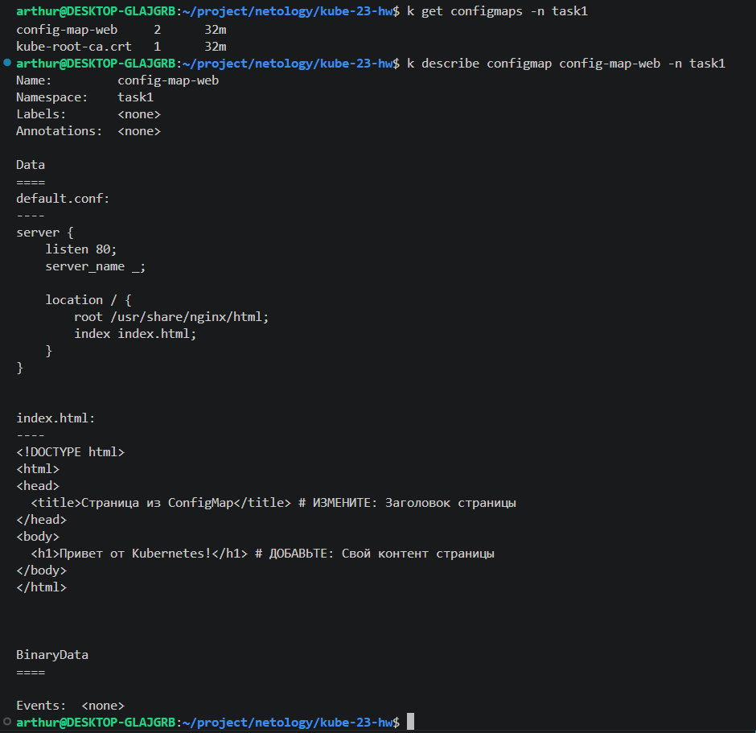
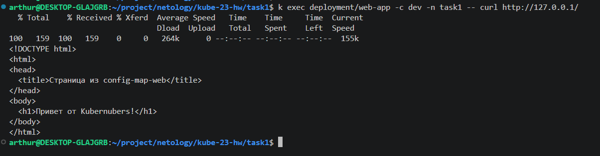
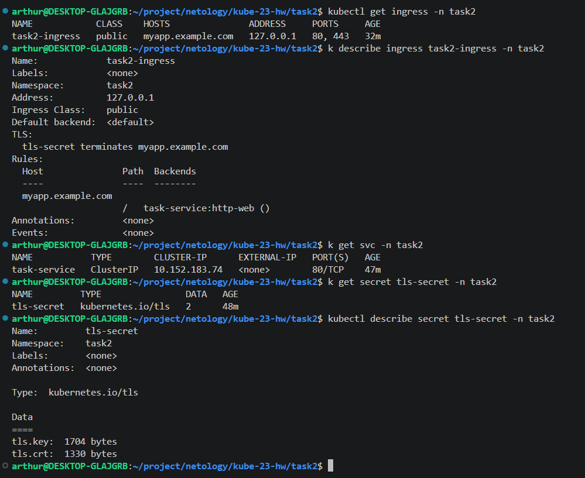
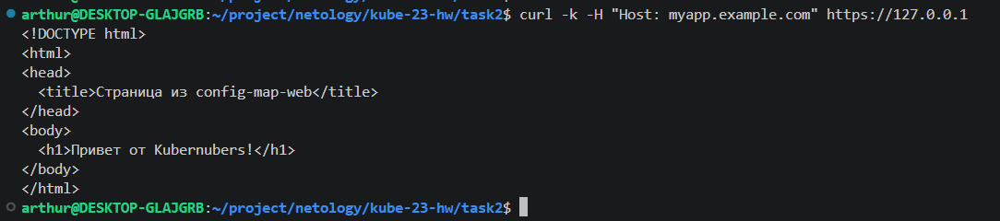
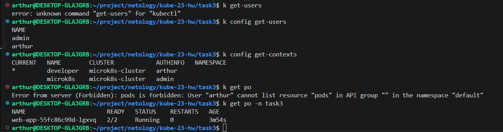

# Домашнее задание к занятию «Настройка приложений и управление доступом в Kubernetes»

## **Задание 1: Работа с ConfigMaps**
### **Задача**
Развернуть приложение (nginx + multitool), решить проблему конфигурации через ConfigMap и подключить веб-страницу.

### **Шаги выполнения**
1. **Создать Deployment** с двумя контейнерами
   - `nginx`
   - `multitool`
3. **Подключить веб-страницу** через ConfigMap
4. **Проверить доступность**

### **Что сдать на проверку**
- Манифесты:
  - `deployment.yaml`
  - `configmap-web.yaml`
- Скриншот вывода `curl` или браузера

---
## **Задание 2: Настройка HTTPS с Secrets**  
### **Задача**  
Развернуть приложение с доступом по HTTPS, используя самоподписанный сертификат.

### **Шаги выполнения**  
1. **Сгенерировать SSL-сертификат**
```bash
openssl req -x509 -nodes -days 365 -newkey rsa:2048 \
  -keyout tls.key -out tls.crt -subj "/CN=myapp.example.com"
```
2. **Создать Secret**
3. **Настроить Ingress**
4. **Проверить HTTPS-доступ**

### **Что сдать на проверку**  
- Манифесты:
  - `secret-tls.yaml`
  - `ingress-tls.yaml`
- Скриншот вывода `curl -k`

---
## **Задание 3: Настройка RBAC**  
### **Задача**  
Создать пользователя с ограниченными правами (только просмотр логов и описания подов).

### **Шаги выполнения**  
1. **Включите RBAC в microk8s**
```bash
microk8s enable rbac
```
2. **Создать SSL-сертификат для пользователя**
```bash
openssl genrsa -out developer.key 2048
openssl req -new -key developer.key -out developer.csr -subj "/CN={ИМЯ ПОЛЬЗОВАТЕЛЯ}"
openssl x509 -req -in developer.csr -CA {CA серт вашего кластера} -CAkey {CA ключ вашего кластера} -CAcreateserial -out developer.crt -days 365
```
3. **Создать Role (только просмотр логов и описания подов) и RoleBinding**
4. **Проверить доступ**

### **Что сдать на проверку**  
- Манифесты:
  - `role-pod-reader.yaml`
  - `rolebinding-developer.yaml`
- Команды генерации сертификатов
- Скриншот проверки прав (`kubectl get pods --as=developer`)

---

### **3. Secret для TLS-сертификата**
```yaml
apiVersion: v1
kind: Secret
metadata:
  name: tls-secret # ИЗМЕНИТЕ при необходимости
type: kubernetes.io/tls
data:
  tls.crt: # ЗАМЕНИТЕ на base64-код сертификата (cat tls.crt | base64 -w 0)
  tls.key: # ЗАМЕНИТЕ на base64-код ключа (cat tls.key | base64 -w 0)
```
### **4. Role для просмотра подов**
```yaml
apiVersion: rbac.authorization.k8s.io/v1
kind: Role
metadata:
  name: pod-viewer # ИЗМЕНИТЕ: Название роли
  namespace: default # ВАЖНО: Role работает только в указанном namespace
rules:
- apiGroups: [""] # КЛЮЧЕВОЙ МОМЕНТ: "" означает core API group
  resources: # РАЗРЕШЕННЫЕ РЕСУРСЫ:
    - pods # Доступ к просмотру подов
    - pods/log # Доступ к логам подов
  verbs: # РАЗРЕШЕННЫЕ ДЕЙСТВИЯ:
    - get # Просмотр отдельных подов
    - list # Список всех подов
    - watch # Мониторинг изменений
    - describe # Просмотр деталей
# ДОПОЛНИТЕЛЬНО: Можно добавить больше правил для других ресурсов
```
---

# Решение

## Полезные команды

### Генерировать самоподписанный сертификат и добавить его в секрет
```bash
openssl req -new -x509 -nodes -days 365 -keyout tls.key -out tls.crt
kubectl create secret generic <secret> --from-file=<path/to/file>
```
### Получить список configmaps в namespace
```bash
kubectl get configmaps -n <namespace>
```
### Просмотреть содержимое configmap
```bash
kubectl describe configmap <configmap> -n <namespace>
```
### Получить список подов в namespace
```bash
kubectl get pods -n <namespace>
```
### Просмотр логов подов
```bash
kubectl logs <pod> -n <namespace>
```
### Сявзь порта хоста в под
```bash
kubectl port-forward <pod> -n <namespace> <localport>:<podport>
```
### Получить список секретов в namespace
```bash
kubectl get secrets -n <namespace>
```
### Получить детальную информацию о секрете
```bash
kubectl describe secret <secret> -n <namespace>
```
### Выполнить curl запрос к сервису
```bash
kubectl exec <pod> -n <namespace> --  curl <service>:<port>
```

## Задание 1

Из интересного, поместил в 01-configmap-web описание конфига для nginx, остальное осталось как в шаблоне.





## Задание 2

В этой задаче появляется маршрутзатор ingres, ему и  прикрутим наши сертификаты.

Если сформировали сертификат и забыли CN, то вместо перевыпуска можно посмотреть всю информацию по нему:
```bash
openssl x509 -in tls.crt -text -noout
```

Кстати, тут говорят что CN устарел/умер и все тру-devops используют SAN.
Отличие в том, что SAN выпускается на несколько доменов
### Создаём сертификат с несколькими SAN
```bash
openssl req -x509 -nodes -days 365 -newkey rsa:2048 \
  -keyout tls.key -out tls.crt \
  -subj "/CN=myapp.example.com" \
  -addext "subjectAltName=DNS:myapp.example.com,DNS:api.example.com"
```

### Описание ingress 
```bash
kubectl describe ingress <ingress> -n <namespace>
```

Класс public не работает, исправил Ingress:
```yaml
spec:
  ingressClassName: nginx   # public, видимо зависит от версии
```

### Тестируем ingress
```bash
curl -k -H "Host: myapp.example.com" https://127.0.0.1
```

Результаты: 




## Задание 3

Вручную создать пользователя SA и работать через токены:
### Создать SA
```bash
kubectl create sa <sa> -n <namespace>
```
### Получить список SA
```bash
kubectl get sa -n <namespace>
```


Работа через сертификаты:
### Включение RBAC в microk8s
```bash
microk8s enable rbac
```
### Создаём SSL-сертификат для пользователя
```bash
openssl genrsa -out developer.key 2048
openssl req -new -key developer.key -out developer.csr -subj "/CN=<username>"
openssl x509 -req -in developer.csr -CA <CA серт вашего кластера> -CAkey <CA ключ вашего кластера> -CAcreateserial -out developer.crt -days 365
```
### Создаём нового пользователя
```bash
kubectl config set-credentials <username> --client-certificate=developer.crt --client-key=developer.key --embed-certs=true
```
### Создаём и активируем контекст
```bash
kubectl config set-context <contextname> --cluster=microk8s-cluster --user=<username>
kubectl config use-context <contextname>
```
### Вернуться назад можно выбрав контекст
```bash
kubectl config use-context microk8s
```
После выбора контекста выполнить команду:
```bash
kubectl get pods -n task3
```
Как видно мы ограничили не только доступ к сервисам и назначили права доступа, но и привязали контекст к namespace.

